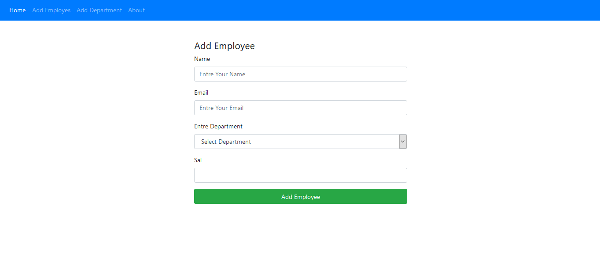

# A Crud App For Managing Employees And Departments

---

---

## Description

- A java Spring boot Thymeleaf App For Manging Employess And Departments

#### Fonctionnalites

- Crud Departments (Cascade )
- Crud Employess
- Validation

---

#### Technologies

- Java Spring boot
- Thymeleaf
- Hibernate
- MYSQl or h2
- Bootstrap

---

#### Installation

1. Change in application.properties the Username && Thepass
2. Start Mysql
3. run  
   `.\mvnw.cmd spring-boot:run`

#### Tools

- vscode + spring boot plugin
- Xammp

- To use The App In production Change
